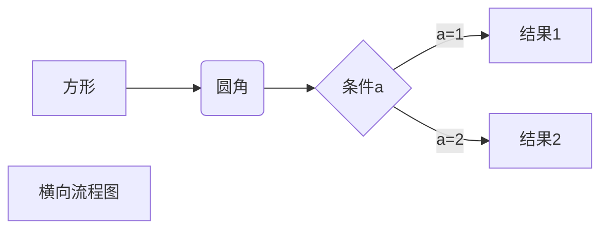
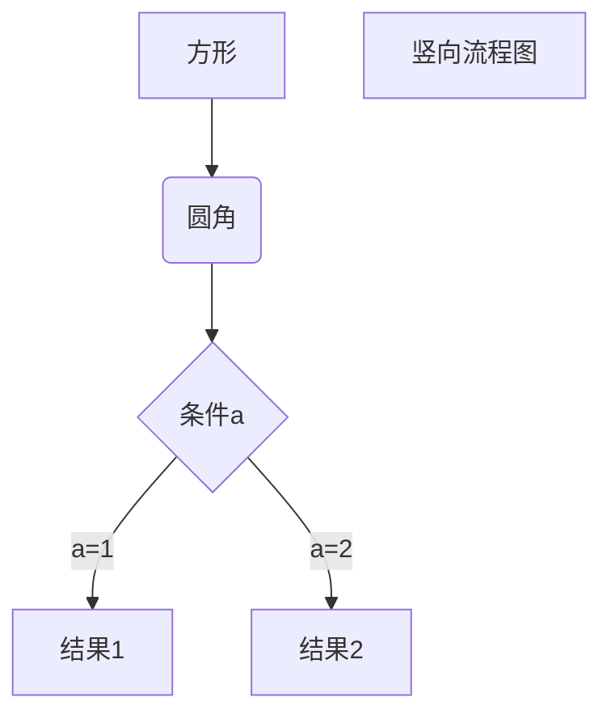
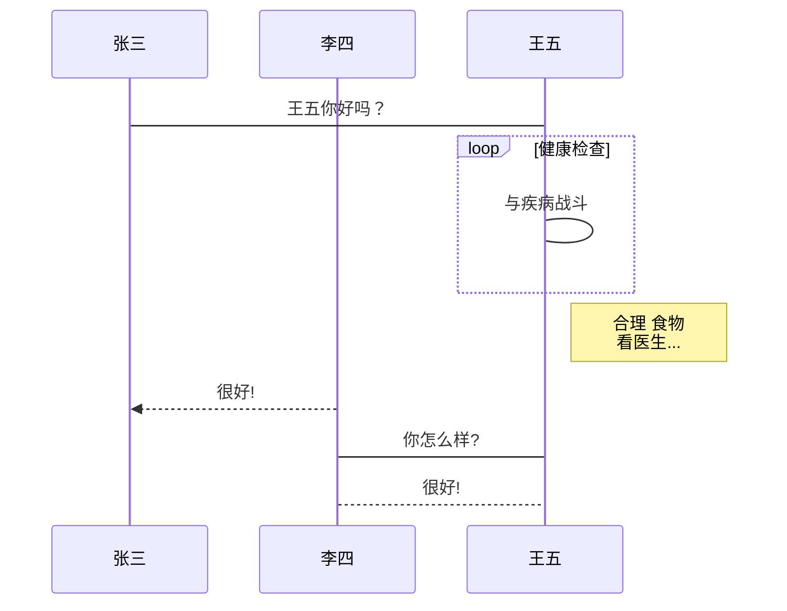

[Markdown基本用法](https://www.runoob.com/markdown/md-tutorial.html)

*<!-- more -->*

#### Markdown 列表

Markdown 支持有序列表和无序列表。

无序列表使用星号(*****)、加号(**+**)或是减号(**-**)作为列表标记，这些标记后面要添加一个空格，然后再填写内容：

```
* 第一项
* 第二项
* 第三项

+ 第一项
+ 第二项
+ 第三项


- 第一项
- 第二项
- 第三项
```

显示结果如下：


有序列表使用数字并加上 **.** 号来表示，如：

```
1. 第一项
2. 第二项
3. 第三项
```

显示结果如下：


##### 列表嵌套

列表嵌套只需在子列表中的选项前面添加四个空格即可：

```
1. 第一项：
    - 第一项嵌套的第一个元素
    - 第一项嵌套的第二个元素
2. 第二项：
    - 第二项嵌套的第一个元素
    - 第二项嵌套的第二个元素
```

显示结果如下：


#### 图片注释

你可以遵循如下写法来对图片进行注释。

markdown图片地址_注释

```md
_谷歌浏览器 Audits - Lighthouse 检测分数_
```


#### 视频局部播放器插入方法之一

利用了xbeibeix的api实现

```md
<iframe id="b" class="b video_pc" src="https://xbeibeix.com/api/bilibili/biliplayer/?url=
https://www.bilibili.com/video/BV1RW411S7As/" 
frameborder="0"
framespacing="0"
allowfullscreen="true"
style="position: middle;
width="100%" 
height="600" 
controls="controls" 
autoplay="autoplay"
quality="high">
</video>>
</iframe>
```
示例

<iframe id="b" class="b video_pc" src="https://xbeibeix.com/api/bilibili/biliplayer/?url=
https://www.bilibili.com/video/BV1RW411S7As/" 
frameborder="0"
framespacing="0"
allowfullscreen="true"
style="position: middle;
width="100%" 
height="600" 
controls="controls" 
autoplay="autoplay"
quality="high">
</video>>
</iframe>

#### 视频全局化插入

取消api的使用，其余语法一致

```md
<iframe id="b" class="b video_pc" src="
https://www.bilibili.com/video/BV1RW411S7As/" 
frameborder="0"
framespacing="0"
allowfullscreen="true"
style="position: middle;
width="100%" 
height="600" 
controls="controls" 
autoplay="autoplay"
quality="high">
</video>>
</iframe>
```
示例

<iframe id="b" class="b video_pc" src="
https://www.bilibili.com/video/BV1RW411S7As/" 
frameborder="0"
framespacing="0"
allowfullscreen="true"
style="position: middle;
width="100%" 
height="600" 
controls="controls" 
autoplay="autoplay"
quality="high">
</video>>
</iframe>

#### 新增草稿语法

1、添加草稿：hexo new draft "xx"
2、预览草稿：hexo server --draft
3、发布草稿：hexo publish draft "xx"

#### 新增的tag-common语法

```


<!-- tab -->

**This is Tab 1.**

<!-- endtab -->

<!-- tab -->

**This is Tab 2.**

<!-- endtab -->

<!-- tab -->

**This is Tab 3.**

<!-- endtab -->


```



<!-- tab -->

**This is Tab 1.**

<!-- endtab -->

<!-- tab -->

**This is Tab 2.**

<!-- endtab -->

<!-- tab -->

**This is Tab 3.**

<!-- endtab -->



#### 单元格语法

```md
|  表头   | 表头  |
|  ----  | ----  |
| 单元格  | 单元格 |
| 单元格  | 单元格 |
```

实例

| 表头   | 表头   |
| ------ | ------ |
| 单元格 | 单元格 |
| 单元格 | 单元格 |

```md
| 左对齐 | 右对齐 | 居中对齐 |
| :-----| ----: | :----: |
| 单元格 | 单元格 | 单元格 |
| 单元格 | 单元格 | 单元格 |
```

| 左对齐 | 右对齐 | 居中对齐 |
| :----- | -----: | :------: |
| 单元格 | 单元格 |  单元格  |
| 单元格 | 单元格 |  单元格  |

#### Markdown 高级技巧

##### 支持的 HTML 元素

不在 Markdown 涵盖范围之内的标签，都可以直接在文档里面用 HTML 撰写。

目前支持的 HTML 元素有：`<kbd> <b> <i> <em> <sup> <sub> <br>`等 ，如：

```md
使用 <kbd>Ctrl</kbd>+<kbd>Alt</kbd>+<kbd>Del</kbd> 重启电脑
```

使用 <kbd>Ctrl</kbd>+<kbd>Alt</kbd>+<kbd>Del</kbd> 重启电脑

Markdown 支持以下这些符号前面加上反斜杠来帮助插入普通的符号：

```
\   反斜线
`   反引号
*   星号
_   下划线
{}  花括号
[]  方括号
()  小括号
#   井字号
+   加号
-   减号
.   英文句点
!   感叹号
```

另外有的编辑器自带注入功能，更快

#### 公式

当你需要在编辑器中插入数学公式时，可以使用两个美元符 $$ 包裹 TeX 或 LaTeX 格式的数学公式来实现。提交后，问答和文章页会根据需要加载 Mathjax 对数学公式进行渲染。如：

```
$$
\mathbf{V}_1 \times \mathbf{V}_2 =  \begin{vmatrix} 
\mathbf{i} & \mathbf{j} & \mathbf{k} \\
\frac{\partial X}{\partial u} &  \frac{\partial Y}{\partial u} & 0 \\
\frac{\partial X}{\partial v} &  \frac{\partial Y}{\partial v} & 0 \\
\end{vmatrix}
${$tep1}{\style{visibility:hidden}{(x+1)(x+1)}}
$$
```

经过渲染后如下
$$
\mathbf{V}_1 \times \mathbf{V}_2 =  \begin{vmatrix} 
\mathbf{i} & \mathbf{j} & \mathbf{k} \\
\frac{\partial X}{\partial u} &  \frac{\partial Y}{\partial u} & 0 \\
\frac{\partial X}{\partial v} &  \frac{\partial Y}{\partial v} & 0 \\
\end{vmatrix}
${$tep1}{\style{visibility:hidden}{(x+1)(x+1)}}
$$

#### 流程图

以下几个实例效果图如下：

##### **1、横向流程图源码格式：**

```
​```mermaid
graph LR
A[方形] -->B(圆角)
    B --> C{条件a}
    C -->|a=1| D[结果1]
    C -->|a=2| E[结果2]
    F[横向流程图]
​```
```



##### **2、竖向流程图源码格式：**

```
​```mermaid
graph TD
A[方形] --> B(圆角)
    B --> C{条件a}
    C --> |a=1| D[结果1]
    C --> |a=2| E[结果2]
    F[竖向流程图]
​```
```



##### **3、标准流程图源码格式：**

```
​```flow
st=>start: 开始框
op=>operation: 处理框
cond=>condition: 判断框(是或否?)
sub1=>subroutine: 子流程
io=>inputoutput: 输入输出框
e=>end: 结束框
st->op->cond
cond(yes)->io->e
cond(no)->sub1(right)->op
​```
```

```flow
st=>start: 开始框
op=>operation: 处理框
cond=>condition: 判断框(是或否?)
sub1=>subroutine: 子流程
io=>inputoutput: 输入输出框
e=>end: 结束框
st->op->cond
cond(yes)->io->e
cond(no)->sub1(right)->op
```

##### **4、标准流程图源码格式（横向）：**

```
​```flow
st=>start: 开始框
op=>operation: 处理框
cond=>condition: 判断框(是或否?)
sub1=>subroutine: 子流程
io=>inputoutput: 输入输出框
e=>end: 结束框
st(right)->op(right)->cond
cond(yes)->io(bottom)->e
cond(no)->sub1(right)->op
​```
```

```flow
st=>start: 开始框
op=>operation: 处理框
cond=>condition: 判断框(是或否?)
sub1=>subroutine: 子流程
io=>inputoutput: 输入输出框
e=>end: 结束框
st(right)->op(right)->cond
cond(yes)->io(bottom)->e
cond(no)->sub1(right)->op
```

##### **5、UML时序图源码样例：**

~~~md
```sequence
对象A->对象B: 对象B你好吗?（请求）
Note right of 对象B: 对象B的描述
Note left of 对象A: 对象A的描述(提示)
对象B-->对象A: 我很好(响应)
对象A->对象B: 你真的好吗？
```
~~~

```sequence
对象A->对象B: 对象B你好吗?（请求）
Note right of 对象B: 对象B的描述
Note left of 对象A: 对象A的描述(提示)
对象B-->对象A: 我很好(响应)
对象A->对象B: 你真的好吗？
```

##### **6、UML时序图源码复杂样例：**

~~~md
```sequence
Title: 标题：复杂使用
对象A->对象B: 对象B你好吗?（请求）
Note right of 对象B: 对象B的描述
Note left of 对象A: 对象A的描述(提示)
对象B-->对象A: 我很好(响应)
对象B->小三: 你好吗
小三-->>对象A: 对象B找我了
对象A->对象B: 你真的好吗？
Note over 小三,对象B: 我们是朋友
participant C
Note right of C: 没人陪我玩
```
~~~

```sequence
Title: 标题：复杂使用
对象A->对象B: 对象B你好吗?（请求）
Note right of 对象B: 对象B的描述
Note left of 对象A: 对象A的描述(提示)
对象B-->对象A: 我很好(响应)
对象B->小三: 你好吗
小三-->>对象A: 对象B找我了
对象A->对象B: 你真的好吗？
Note over 小三,对象B: 我们是朋友
participant C
Note right of C: 没人陪我玩
```

##### **7、UML标准时序图样例：**

~~~md

~~~


##### **8、甘特图样例：**

~~~md
```mermaid
%% 语法示例
        gantt
        dateFormat  YYYY-MM-DD
        title 软件开发甘特图
        section 设计
        需求                      :done,    des1, 2014-01-06,2014-01-08
        原型                      :active,  des2, 2014-01-09, 3d
        UI设计                     :         des3, after des2, 5d
    未来任务                     :         des4, after des3, 5d
        section 开发
        学习准备理解需求                      :crit, done, 2014-01-06,24h
        设计框架                             :crit, done, after des2, 2d
        开发                                 :crit, active, 3d
        未来任务                              :crit, 5d
        耍                                   :2d
        section 测试
        功能测试                              :active, a1, after des3, 3d
        压力测试                               :after a1  , 20h
        测试报告                               : 48h
~~~

```mermaid
%% 语法示例
        gantt
        dateFormat  YYYY-MM-DD
        title 软件开发甘特图
        section 设计
        需求                      :done,    des1, 2014-01-06,2014-01-08
        原型                      :active,  des2, 2014-01-09, 3d
        UI设计                     :         des3, after des2, 5d
    未来任务                     :         des4, after des3, 5d
        section 开发
        学习准备理解需求                      :crit, done, 2014-01-06,24h
        设计框架                             :crit, done, after des2, 2d
        开发                                 :crit, active, 3d
        未来任务                              :crit, 5d
        耍                                   :2d
        section 测试
        功能测试                              :active, a1, after des3, 3d
        压力测试                               :after a1  , 20h
        测试报告                               : 48h
```

#### Markdown 代码

如果是段落上的一个函数或片段的代码可以用反引号把它包起来（**`**），例如：

```
`printf()` 函数
```

显示结果如下：

`printf()` 函数


#### 代码区块

代码区块使用 **4 个空格**或者一个**制表符（Tab 键）**。

实例如下：


显示结果如下：


你也可以用 **```** 包裹一段代码，并指定一种语言（也可以不指定）：

~~~md
```javascript
$(document).ready(function () {
    alert('RUNOOB');
});
```
~~~

显示结果如下：

